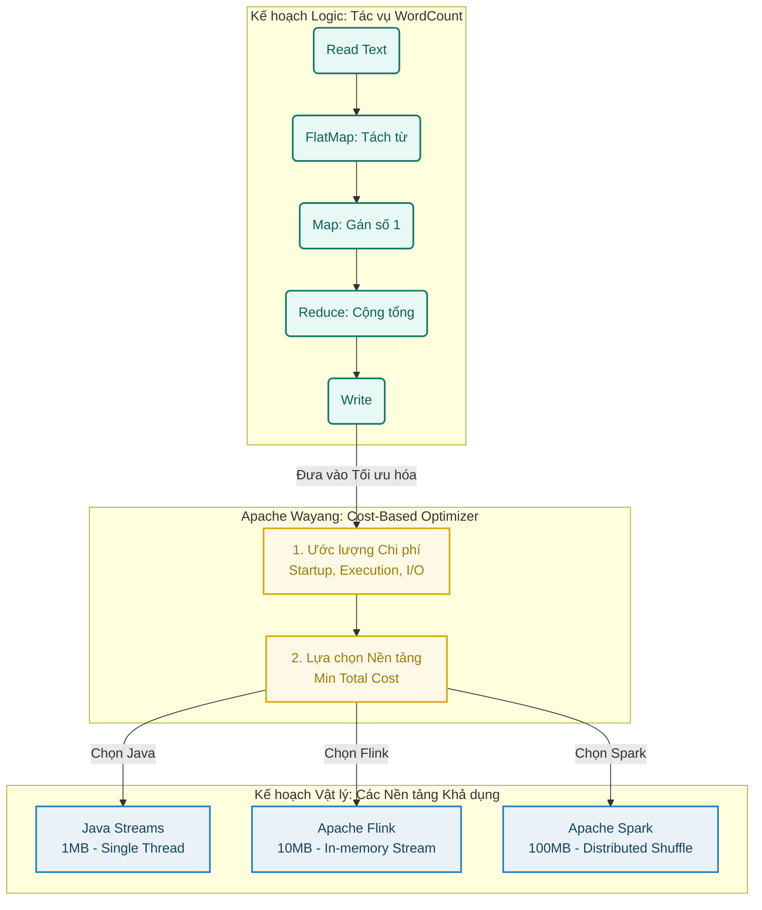

<div align="center">
  <h1>Apache Wayang: Cost-Based Optimizer & Platform Adaptation</h1>
  
  [](https://java.com)
  [](https://maven.apache.org/)
  [](https://python.org)
  [](https://wayang.apache.org/)
</div>

---

## 📖 Tóm tắt (Abstract)
**Apache Wayang** (tiền thân là Rheem) đại diện cho một bước tiến quan trọng trong kiến trúc xử lý dữ liệu liên nền tảng (cross-platform data processing). Đặc tính cốt lõi tạo nên sự linh hoạt của hệ thống này nằm ở khả năng **Thích ứng nền tảng động (Platform Adaptation)** được điều phối bởi **Bộ tối ưu hóa dựa trên chi phí (Cost-Based Optimizer - CBO)**. 

Tài liệu này trình bày phân tích chuyên sâu về cơ sở lý thuyết của CBO, cơ chế ra quyết định định tuyến thực thi, và cung cấp hướng dẫn thực thi (benchmark) nhằm minh họa cách CBO đưa ra lựa chọn tối ưu.

---

## 📋 Mục lục
- [🚀 Hướng dẫn Thực thi (Execution Guide)](#-hướng-dẫn-thực-thi-execution-guide)
  - [1. Yêu cầu hệ thống (Prerequisites)](#1-yêu-cầu-hệ-thống-prerequisites)
  - [2. Cài đặt và Chạy Benchmark](#2-cài-đặt-và-chạy-benchmark)
  - [3. Trực quan hóa kết quả (Plotting)](#3-trực-quan-hóa-kết-quả-plotting)
- [🧠 Cơ sở lý thuyết của CBO](#-cơ-sở-lý-thuyết-của-cbo)
- [⚙️ Quy trình Tối ưu hóa Thuật toán](#️-quy-trình-tối-ưu-hóa-thuật-toán)
- [📊 Phân tích Thực nghiệm Hành vi Định tuyến](#-phân-tích-thực-nghiệm-hành-vi-định-tuyến)
- [🎯 Kết luận](#-kết-luận)

---

## 🚀 Hướng dẫn Thực thi (Execution Guide)

Dự án này bao gồm một chương trình Benchmark tác vụ `WordCount` để minh họa khả năng tự động chọn nền tảng tối ưu (JVM, Flink, Spark) của Apache Wayang dựa trên kích thước dữ liệu.

### 1. Yêu cầu hệ thống (Prerequisites)
Để chạy được mã nguồn và trực quan hóa kết quả, hệ thống của bạn cần cài đặt:
- **Java 8** hoặc mới hơn (Wayang core được tối ưu trên Java 8/11).
- **Apache Maven** (để quản lý dependencies và build project).
- **Python 3.x** cùng thư viện `matplotlib`, `numpy` (để vẽ biểu đồ).
- **Hệ điều hành**: Khuyến nghị Linux, macOS, hoặc Windows Subsystem for Linux (WSL).

### 2. Cài đặt và Chạy Benchmark

**Bắt buộc:** Khởi động hệ thống HDFS trước khi thực thi benchmark để đảm bảo luồng đọc/ghi dữ liệu phân tán hoạt động bình thường:
```bash
start-all.sh
```

Di chuyển vào thư mục chứa mã nguồn Wayang:
```bash
cd wayang
```

Chạy kịch bản thực thi tích hợp sẵn:
```bash
./demo.sh
```
*(Lưu ý: Bạn có thể cần cấp quyền thực thi cho file: `chmod +x demo.sh`)*

**Hoặc chạy thủ công bằng Maven:**
```bash
mvn clean compile
mvn exec:exec -Dexec.executable="java" -Dexec.args="-cp %classpath com.student.Main"
```
Kết quả sau khi chạy sẽ được xuất ra file `results.csv` chứa thông số thời gian thực thi của từng nền tảng và lựa chọn tối ưu của Wayang.

### 3. Trực quan hóa kết quả (Plotting)
Sau khi có file `results.csv`, bạn có thể tạo biểu đồ so sánh tự động bằng Python script.

Cài đặt các thư viện cần thiết (nếu chưa có):
```bash
pip install matplotlib numpy
```

Chạy script vẽ biểu đồ:
```bash
python plot.py
```
Hệ thống sẽ tạo ra tệp hình ảnh **`benchmark_result.png`** thể hiện trực quan thời gian chạy của JVM, Flink, Spark và điểm sao (⭐) đánh dấu lựa chọn của Wayang CBO.

---

## 🧠 Cơ sở lý thuyết của CBO

Trong kiến trúc hệ thống của Apache Wayang, CBO đóng vai trò là bộ điều phối trung tâm. Khi một quy trình xử lý dữ liệu được thiết lập (ví dụ: chuỗi toán tử `read -> flatMap -> map -> reduce -> write`), quy trình này tồn tại dưới dạng một **Đồ thị có hướng không chu trình (DAG)** mang tính trừu tượng, hay còn gọi là **Kế hoạch Logic (Logical Plan)**.

Nhiệm vụ của CBO là giải quyết bài toán nội suy không gian thực thi: tiến hành ánh xạ các toán tử logic (Logical Operators) sang các toán tử vật lý (Physical Operators) tương ứng trên các nền tảng xử lý (Execution Engines) cụ thể như **Java Streams, Apache Flink, hoặc Apache Spark**. Đầu ra của quá trình này là một **Kế hoạch Vật lý (Physical Plan)** đại diện cho một đồ thị thực thi đã được tối ưu hóa về mặt phân bổ tài nguyên.

### Mô hình Luồng Xử lý và Chuyển đổi (Processing Flow)
Dưới đây là sơ đồ mô tả cách CBO tiếp nhận Kế hoạch Logic của tác vụ WordCount và định tuyến thực thi xuống Kế hoạch Vật lý:



---

## ⚙️ Quy trình Tối ưu hóa Thuật toán

Quy trình ra quyết định của CBO được mô hình hóa qua ba giai đoạn định lượng tuyến tính:

### 2.1. Liệt kê không gian giải pháp (Plan Enumeration)
Hệ thống tiến hành duyệt toàn bộ các không gian ánh xạ khả dĩ. Từ một Đồ thị Logic, thuật toán có thể sinh ra các đồ thị thực thi đồng nhất (chỉ sử dụng duy nhất một nền tảng xuyên suốt) hoặc các đồ thị lai ghép (Hybrid Plans) nhằm kết hợp ưu điểm của nhiều nền tảng xử lý khác nhau trong cùng một luồng dữ liệu (pipeline).

### 2.2. Mô hình hóa và Ước lượng chi phí (Cost Estimation)
Mỗi Kế hoạch Vật lý được hệ thống đánh giá thông qua một hàm chi phí (Cost Function). Mô hình chi phí tổng quát được biểu diễn bằng phương trình:

> **$Cost_{total} = w_1 \cdot Cost_{startup} + w_2 \cdot Cost_{execution} + w_3 \cdot Cost_{communication}$**

Trong đó:
* **$w_1, w_2, w_3$ (Trọng số - Weights):** Các hệ số điều chỉnh mức độ ưu tiên giữa các yếu tố chi phí (ví dụ: ưu tiên tốc độ xử lý so với hao phí mạng). Các trọng số này có thể cấu hình tĩnh hoặc tự động tinh chỉnh qua mô hình học máy (Learned Cost Models) của Wayang.
* **$Cost_{startup}$ (Chi phí khởi tạo):** Đặc trưng cho thời gian thiết lập môi trường. Nền tảng cục bộ (JVM) có chi phí này xấp xỉ không, trong khi các nền tảng phân tán (Spark, Flink) đòi hỏi độ trễ đáng kể để cấp phát tài nguyên và khởi tạo cụm máy chủ.
* **$Cost_{execution}$ (Chi phí thực thi):** Ước lượng dựa trên đặc trưng tải (Load Profile), bao gồm kích thước tập dữ liệu đầu vào và độ phức tạp tính toán của toán tử. Đối với dữ liệu quy mô lớn, $Cost_{execution}$ của kiến trúc đơn luồng (như JVM) sẽ gia tăng phi tuyến.
* **$Cost_{communication}$ (Chi phí luân chuyển dữ liệu):** Chỉ hiện diện trong các Kế hoạch Lai. Đây là hao phí truy xuất I/O phát sinh khi hệ thống buộc phải ghi dữ liệu trung gian xuống Disk/HDFS để chuyển giao giữa các nền tảng khác biệt.

### 2.3. Lựa chọn phương án tối ưu (Plan Selection)
Dựa trên kết quả định lượng, CBO tiến hành đối sánh tổng chi phí ($Cost_{total}$) của toàn bộ tập hợp các kế hoạch vật lý khả dĩ. Thuật toán sẽ định tuyến thực thi theo kế hoạch hội tụ tại mức chi phí cực tiểu.

---

## 📊 Phân tích Thực nghiệm Hành vi Định tuyến

Áp dụng lý thuyết trên vào thực nghiệm đánh giá hiệu năng (benchmark) tác vụ `WordCount` với kích thước tập dữ liệu đầu vào biến thiên từ 1MB đến 100MB, cơ chế suy luận của CBO được phản ánh qua các chỉ định định tuyến sau:

### a. Hiện tượng loại bỏ Kế hoạch Lai (Hybrid Plan Rejection)
Do tác vụ `WordCount` mang cấu trúc tuyến tính khép kín, CBO ước lượng rằng lượng dữ liệu trung gian cần chuyển giao giữa các toán tử là cực kỳ lớn. Mô hình toán học chỉ ra rào cản luân chuyển ($Cost_{communication}$) vượt xa lợi ích hiệu năng biên thu được. Do đó, hệ thống chủ động thu hẹp không gian tìm kiếm, **loại bỏ toàn bộ cấu trúc lai ghép** và chỉ đối chiếu các đồ thị đồng nhất (All-JVM, All-Flink, All-Spark).

### b. Mốc thực nghiệm 1MB: Định tuyến tới JVM
* **Đặc tính:** Quy mô dữ liệu không đáng kể.
* **Đánh giá của CBO:** Biến số $Cost_{startup}$ của các nền tảng phân tán tạo ra rào cản chi phí lớn vô nghĩa so với $Cost_{execution}$ thực tế.
* **Kết quả:** Hệ thống ưu tiên kiến trúc có chi phí khởi tạo bằng không. **Kế hoạch tối ưu: JVM**.

### c. Mốc thực nghiệm 10MB: Định tuyến tới Apache Flink
* **Đặc tính:** Dung lượng dữ liệu chạm ngưỡng tải bậc trung.
* **Đánh giá của CBO:** Giới hạn xử lý đơn luồng của JVM dẫn đến hiện tượng thắt cổ chai tại toán tử Reduce, làm gia tăng mạnh $Cost_{execution}$. Ngược lại, khả năng xử lý luồng song song trên bộ nhớ của Flink bù đắp triệt để mức phí khởi tạo ban đầu, biến nền tảng này thành phương án có $Cost_{total}$ thấp nhất.
* **Kết quả:** **Kế hoạch tối ưu: Apache Flink**.

### d. Mốc thực nghiệm 100MB: Định tuyến tới Apache Spark
* **Đặc tính:** Dung lượng dữ liệu lớn, giả lập môi trường phân tán.
* **Đánh giá của CBO:** Đây là minh chứng cho năng lực dự báo phần cứng của CBO. CBO nhận diện rủi ro tràn bộ nhớ cục bộ của Flink đối với tập dữ liệu hàng trăm megabyte. Thay vào đó, mô hình chi phí ghi nhận cơ chế phân mảnh dữ liệu và khả năng xử lý xáo trộn dữ liệu (Shuffle) phân tán của Spark mang lại độ ổn định hệ thống và $Cost_{execution}$ an toàn hơn.
* **Kết quả:** Hệ thống chấp nhận chi phí khởi tạo để đảm bảo tính toàn vẹn và hiệu suất xử lý quy mô lớn. **Kế hoạch tối ưu: Apache Spark**.

---

## 🎯 Kết luận

Hệ thống Cost-Based Optimizer của Apache Wayang không hoạt động như một thuật toán đo lường tốc độ bề mặt tĩnh. Bằng cách thiết lập mô hình toán học cân bằng giữa độ trễ khởi tạo (Startup Overhead), năng lực xử lý tải (Scalability Bottleneck) và rào cản băng thông I/O giữa các hệ thống, Wayang cung cấp một cơ chế định tuyến thông minh. Kiến trúc này đảm bảo khả năng linh hoạt và tối ưu hóa tài nguyên triệt để cho các luồng xử lý dữ liệu phức tạp trong thực tiễn công nghiệp.